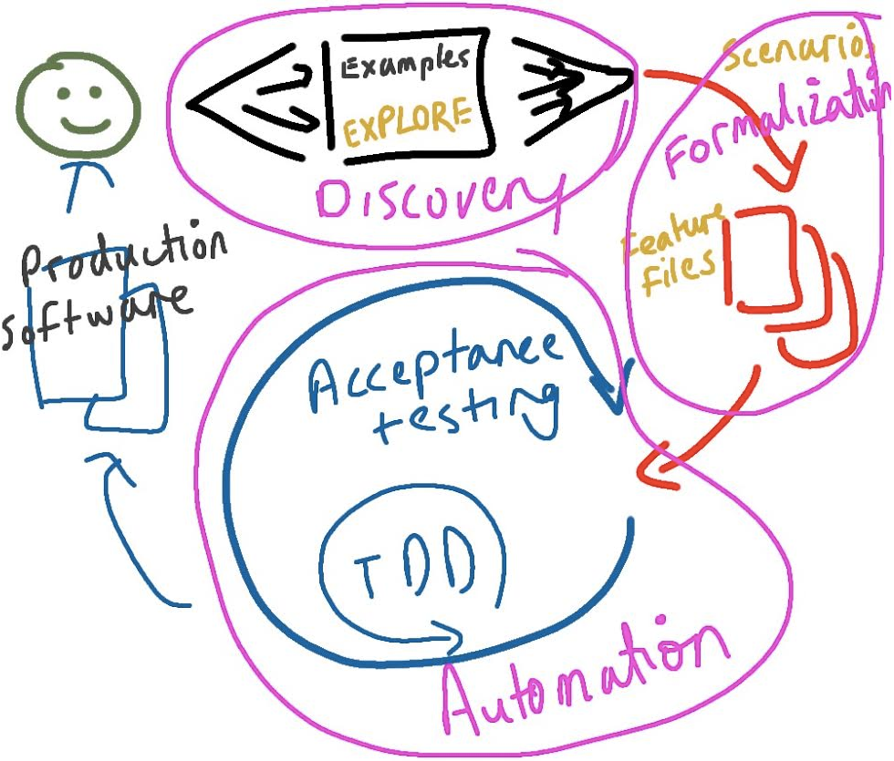
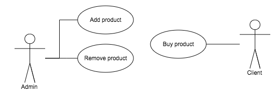
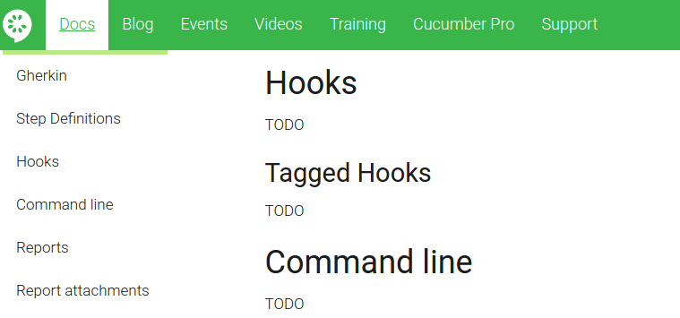

# CUCUMBER


by @jomaora

#VSLIDE

Installation

```
npm i --save-dev cucumber
```

#VSLIDE

Tool for running automated tests, but a little bit more...

A single source of truth
- Merging specifications and tests documentations
- Documentation in test is related to code, so it will be updated documentation.

#VSLIDE

Cucumber is for Behaviour-Driven Development



#VSLIDE

Gerkhin syntax is used in order to write the scenarios.

#HSLIDE

#GERKHIN

#VSLIDE

- Uses indentation to define its structure
- _Most lines_ start with a keyword
- Each file input will describe a features with its scenarios and steps.

#VSLIDE

```
Feature: Some terse yet descriptive text of what is desired
    Textual description of the business value of this feature
    Business rules that govern the scope of the feature
    Any additional information that will make the feature easier to understand

    Scenario: Some determinable business situation
        Given some precondition
            And some other precondition
        When some action by the actor
            And some other action
            And yet another action
        Then some testable outcome is achieved
            And something else we can check happens too

    Scenario: A different situation
```

#VSLIDE

# FEATURES

Features are described in *.feature files

This files are normally found in a 'features' directory:
- A Feature contains a list of scenarios: concrete example that illustrates a business rule.

#VSLIDE

# SCENARIOS

Scenarios follow the same pattern:

- Describe an initial context
- Describe an event
- Describe an expected outcome

Scenario workflow is described using steps, which must start with one of the keywords Given, When, Then, But or And.


#VSLIDE

# STEPS

* **Given**: describe the initial context of the system

* **When**: describe an event, or an action to be tested

* **Then**: describe an expected outcome, or result

* **And, But**: grammatical conjunctions to be used with Given and Then

#VSLIDE

#Let's test!



#VSLIDE

# Defining a feature

```
Feature: Stock management
  It can be only access by admin user. Products can be added or remove to the stock
```

#VSLIDE

# Defining related scenarios

```
Feature: Stock management
  It can be only access by admin user. Products can be added, update or remove to the stock
  
  Scenario: Admin adds new product to the stock
  
  Scenario: Client adds new product to the stock
  
  Scenario: Admin update existing product to the stock
  
  Scenario: Admin removes product to the stock
```

#VSLIDE

# Defining the steps

```
Feature: Stock management
  It can be only access by admin user. Products can be added, update or remove to the stock
  
  Scenario: Admin adds new product to the stock
    Given User in session is Admin
    When he add 5 units of Tomatoes, item price: 3.5$
    Then Stock is not empty
    And Stock contains 5 units of Tomatoes
  
  Scenario: Client adds new product to the stock
  
  Scenario: Admin update existing product to the stock
  
  Scenario: Admin removes product to the stock
```

#VSLIDE

# Implementation

- Each step defined within the feature should be mapped by a function
- This functions belongs to a nodeJS file, located in the **/features/step_definitions** directory

```
'use strict'

module.exports = function() {
    this.[Given|When|Then](REGEX_TO_MATCH_STEP, function (valueFromRegex1, valueFromRegex2[, callback]) {
        // Write code here that turns the phrase above into concrete actions
    });
}
```

#VSLIDE

# Implementation

```
'use strict'

module.exports = function() {
    this.Given(/^User in session is Admin$/, function (callback) {
        // Write code here that turns the phrase above into concrete actions
        callback(null, 'pending');
    });
    
    this.When(/^he add (\d+) units of Tomatoes, item price: (\d+)\.(\d+)\$$/, function (arg1, arg2, arg3, callback) {
        // Write code here that turns the phrase above into concrete actions
        callback(null, 'pending');
    });
    
    this.Then(/^Stock is not empty$/, function (callback) {
        // Write code here that turns the phrase above into concrete actions
        callback(null, 'pending');
    });
    
    this.Then(/^Stock contains (\d+) units of Tomatoes$/, function (arg1, callback) {
        // Write code here that turns the phrase above into concrete actions
        callback(null, 'pending');
    });
}
```

#HSLIDE

#"ADVANCED" FEATURES

#VSLIDE

Sometimes, some scenarios can be factorised:

```
Feature: Buying products from stock

  Scenario: Client buy Tomatoes
    Given The stock has 20 units of Tomatoes, item price 2$
    And User in session is Client
    And User will give 20$ to pay
    When User buy 4 units of Tomatoes
    Then The stock should have 12 units of Tomatoes
    And User should receive 2$ as change

  Scenario: Client buy Bananas
    Given The stock has 5 units of Bananas, item price 1$
    And User in session is Client
    And User will give 10$ to pay
    When User buy 4 units of Bananas
    Then The stock should have 1 units of Bananas
    And User should receive 6$ as change
```

#VSLIDE

#BACKGROUND

Refactor incidental details.

```
Feature: Buying products from stock
  Background:
    Given The stock has 20 units of Tomatoes, item price 2$
    Given The stock has 5 units of Bananas, item price 1$
    And User in session is Client

  Scenario: Client buy Tomatoes
    Given User will give 20$ to pay
    When User buy 4 units of Tomatoes
    Then Stock contains 12 units of Tomatoes
    And User should receive 2$ as change

  Scenario: Client buy Bananas
    Given User will give 10$ to pay
    When User buy 4 units of Bananas
    Then Stock contains 1 units of Bananas
    And User should receive 6$ as change
```

#VSLIDE

#TAGS

- In order to run an specific test, we can tag a test using _@TAG-FOR-MY-TEST_ to the top of the file.
- Command line will change to

```
cucumber --tags @TAG-FOR-MY-TEST
npm test -- --tags @TAG-FOR-MY-TEST
```

#VSLIDE

#Data Tables

Data Tables are handy for passing a list of values to a step definition

```
Background:
  Given The stock has 20 units of Tomatoes, item price 2$
  Given The stock has 5 units of Bananas, item price 1$
```

becomes...

```
Background:
  Given A stock having
    | name     | units | price |
    | Tomatoes | 20    | 2     |
    | Bananas  | 5     | 1     |
```

#VSLIDE

When using datatable, the matching function will receive a table within the arguments

```
this.Given(/^A stock having$/, function (table, callback) {
  // Write code here that turns the phrase above into concrete actions
  callback(null, 'pending');
});
```

Table object has the following methods
- getType
- rows
- rowsHash
- raw
- hashes

#VSLIDE

#Scenario Outline

- Refactor scenarios that only differ by their values
- A datatable _Examples_ is used to pass these values

```
Scenario Outline: Client buy Product
  Given User will give <avaliableMoney>$ to pay
  When User buy <quantity> units of <product>
  Then Stock contains <stockQuantity> units of <product>
  And User should receive <change>$ as change

  Examples:
  | avaliableMoney | quantity | product  | stockQuantity | change |
  | 20             | 4        | Tomatoes | 16            | 12     |
  | 10             | 4        | Bananas  | 1             | 6      |
```

#VSLIDE

#Hooks

- There are also before and after hooks as well as other test tools.
- They're defined in supports directory

```
var myHooks = function () {
  this.Before(function (scenario) {
    // Before code
  });

};

module.exports = myHooks;
```

#HSLIDE

#COVERAGE

```
istanbul cover cucumber-js
```

#HSLIDE

#PROs & CONs


#VSLIDE


Cucumber supports over 60 spoken languages, which mean that feature scenarios can be written in people spoken language.

#VSLIDE


```
language: es

Característica: Administración del Stock
  Sólo puede tener acceso el Administrador

  Escenario: El Administrador agrega un nuevo producto al stock
    Dado Usuario en sesión es Admin
    Cuando Él agrega 5 unidades de Tomates, precio por item: 3.5$
    Entonces El Stock no está vacío
    Y El Stock contiene 5 unidades de Tomates
```

But the flag --language seems to no be implemeted yet for cucumbre-js. :(

#VSLIDE


- Problems with arrow functions and using world attributes. (Access to this)
- When a step definition is not implemented, it can not generate it automatically.
- It seems we must cast each parameter coming from the regex if they're not strings.
- And...

#VSLIDE

Fucking incomplete doc!!!




#HSLIDE

- Thanks
- Merci
- Obrigado
- Спасибо
- Gracias